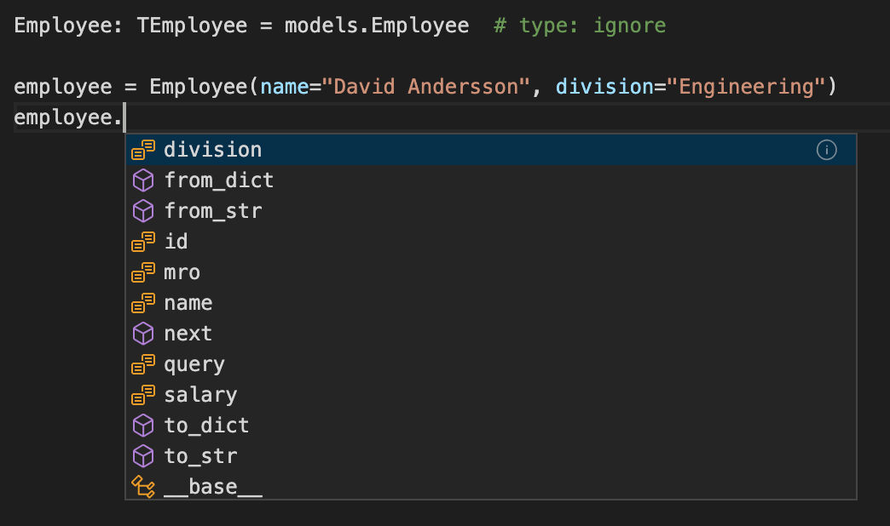

[](https://dev.azure.com/anderssonpublic/anderssonpublic/_build/latest?definitionId=1&branchName=master)  [](https://openapi-sqlalchemy.readthedocs.io/en/latest/?badge=latest)   

# OpenAlchemy

Translates an OpenAPI schema to SQLAlchemy models.

Get started with the online editor that will guide you through using your existing OpenAPI specification to define your database schema:
[Online Editor](https://editor.openalchemy.io)

## Installation

```bash
python -m pip install OpenAlchemy
# To be able to load YAML file
python -m pip install OpenAlchemy[yaml]
```

## Example

For example, given the following OpenAPI specification:

```yaml
# ./examples/simple/example-spec.yml
openapi: "3.0.0"

info:
  title: Test Schema
  description: API to illustrate OpenAlchemy MVP.
  version: "0.1"

paths:
  /employee:
    get:
      summary: Used to retrieve all employees.
      responses:
        200:
          description: Return all employees from the database.
          content:
            application/json:
              schema:
                type: array
                items:
                  "$ref": "#/components/schemas/Employee"

components:
  schemas:
    Employee:
      description: Person that works for a company.
      type: object
      x-tablename: employee
      properties:
        id:
          type: integer
          description: Unique identifier for the employee.
          example: 0
          x-primary-key: true
          x-autoincrement: true
        name:
          type: string
          description: The name of the employee.
          example: David Andersson
          x-index: true
        division:
          type: string
          description: The part of the company the employee works in.
          example: Engineering
          x-index: true
        salary:
          type: number
          description: The amount of money the employee is paid.
          example: 1000000.00
      required:
        - id
        - name
        - division
```

The SQLALchemy models file then becomes:

```python
# models.py
from open_alchemy import init_yaml

init_yaml("./examples/simple/example-spec.yml")
```

The _Base_ and _Employee_ objects can be accessed:

```python
from open_alchemy.models import Base
from open_alchemy.models import Employee
```

With the _models_filename_ parameter a file is auto generated with type hints for the SQLAlchemy models at the specified location, for example: [type hinted models example](examples/simple/models_auto.py). This adds support for IDE auto complete, for example for the model initialization:


and for properties and methods available on an instance:



An extensive set of examples with a range of features is here:

[examples for main features](examples)

An example API has been defined using connexion and Flask here:

[example connexion app](examples/app)

## Documentation

[Read the Docs](https://openapi-sqlalchemy.readthedocs.io/en/latest/)

## Features

- initializing from JSON,
- initializing from YAML,
- build a package with the models for distribution, packaged as sdist or wheel,
- automatically generate a models file,
- `integer` (32 and 64 bit),
- `number` (float only),
- `boolean`,
- `string`,
- `password`,
- `byte`,
- `binary`,
- `date`,
- `date-time`,
- generic JSON data,
- `$ref` references for columns and models,
- remote `$ref` to other files on the same file system (_not supported on Windows_),
- remote `$ref` to other files at a URL,
- primary keys,
- auto incrementing,
- indexes,
- composite indexes,
- unique constraints,
- composite unique constraints,
- column nullability,
- foreign keys,
- default values for columns,
- many to one relationships,
- one to one relationships,
- one to many relationships,
- many to many relationships,
- custom foreign keys for relationships,
- back references for relationships,
- `allOf` inheritance for columns and models,
- joined and single table inheritance,
- `from_str` model methods to construct from JSON string,
- `from_dict` model methods to construct from dictionaries,
- `to_str` model methods to convert instances to JSON string,
- `__str__` model methods to support the python `str` function,
- `__repr__` model methods to support the python `repr` function,
- `to_dict` model methods to convert instances to dictionaries,
- `readOnly` and `writeOnly` for influence the conversion to and from dictionaries,
- exposing created models under `open_alchemy.models` removing the need for `models.py` files and
- ability to mix in arbitrary classes into a model.

## Contributing

Fork and checkout the repository. To install:

```bash
python -m venv venv
source ./venv/bin/activate
python -m pip install -e .[dev,test]
```

To run tests:

```bash
tox
```

Make your changes and raise a pull request.

## Compiling Docs

```bash
python -m venv venv
cd docs
make html
```

This creates the `index.html` file in `docs/build/html/index.html`.

## Release Commands

```bash
rm -r dist/*
python -m pip install --upgrade pip
python -m pip install --upgrade setuptools wheel
python setup.py sdist bdist_wheel
python -m pip install --upgrade twine
python -m twine upload dist/*
```
