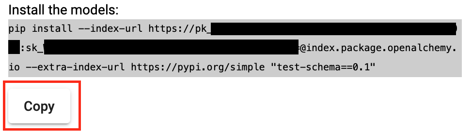
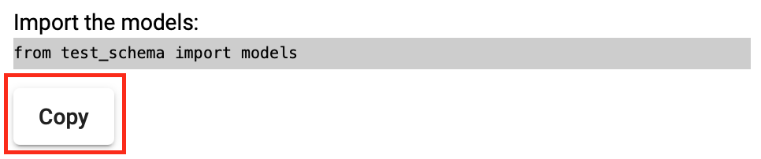

.. role:: python(code)
  :language: python

.. _package-service:

Package Service
===============

To make it easier to distribute your models, the package service converts your
OpenAPI specification to pip installable models. To get started, go to the
`Online Editor <https://editor.openalchemy.io/>`_ and either pick from one of
the available examples or write your own OpenAPI specification.

The editor will help you ensure that your OpenAPI specification is valid. Once
your OpenAPI specification is ready, hit the :samp:`Save` button:

.. image:: ./package-service-save.png
  :width: 400

.. note:: You might need to create a free account.

Shortly after, instructions will be displayed to install your models using
:samp:`pip`:

Additionally, information is also shown for how to import the models. On top of
importing all models, you are also able to import a specific model. For
example, if you have defined the :samp:`Employee` schema you can also import
:samp:`Employee` from your package.

Manage your Packages
--------------------

To see all packages for your account go to:
`Package Management <https://package.openalchemy.io/>`_.

